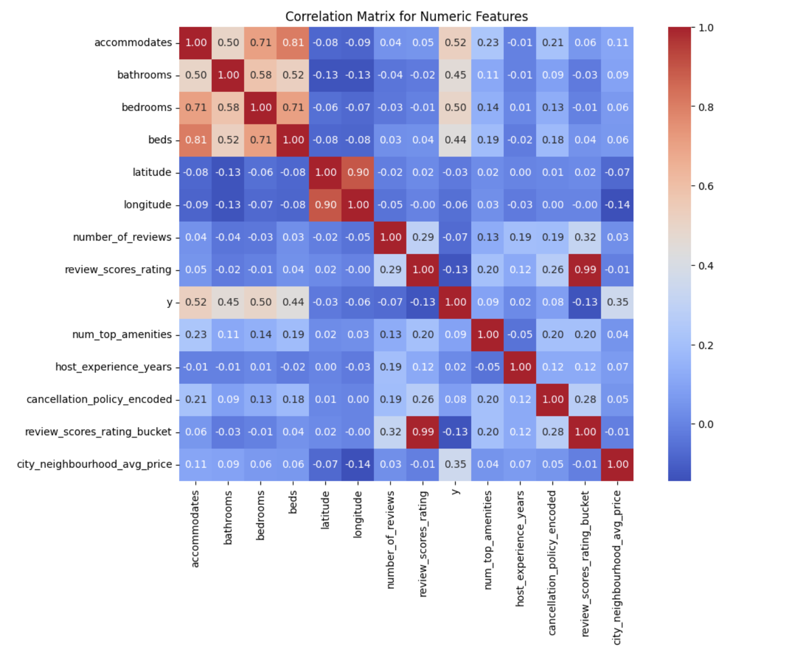
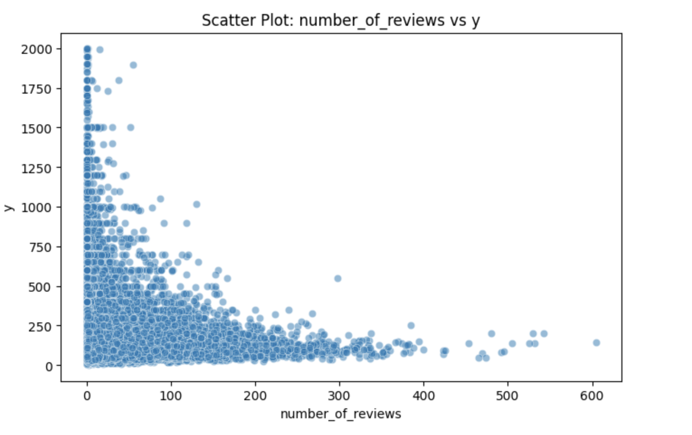
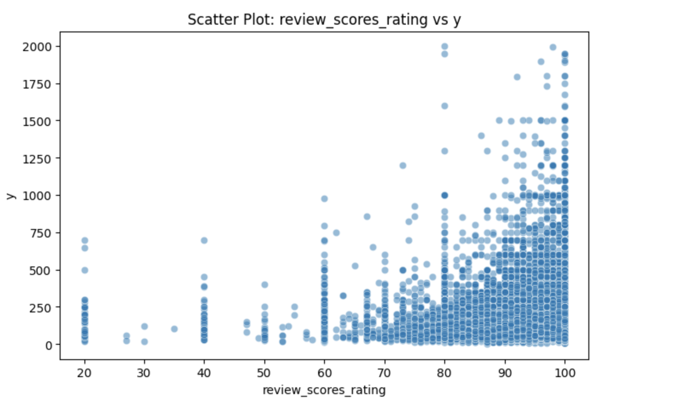
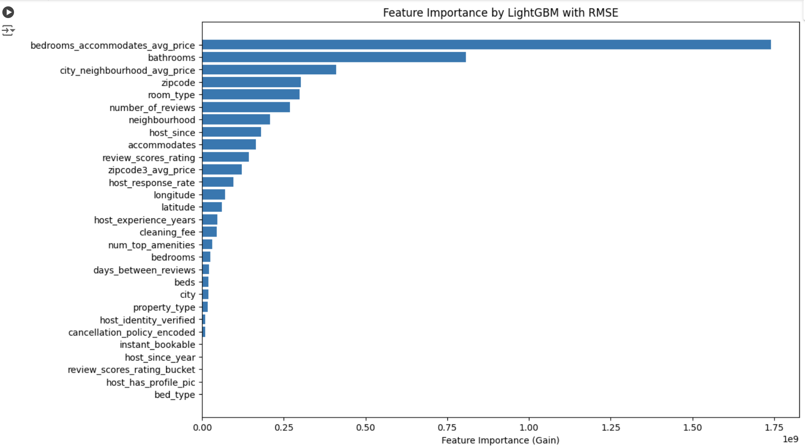
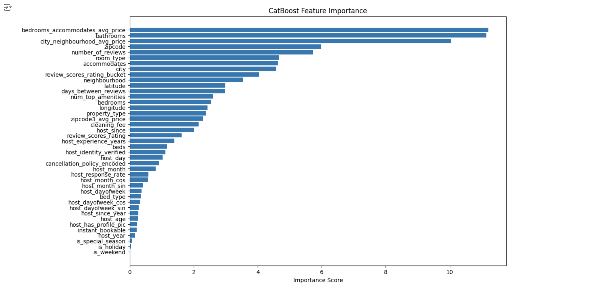

# 民泊サービス宿泊価格予測モデルの構築（練習問題）

本プロジェクトでは、民泊サービスの物件データを使用し、宿泊価格を予測する高精度なモデルを構築しました。このプロジェクトは過去のコンペを題材に取り組んだもので、データの前処理、特徴量エンジニアリング、複数の機械学習モデルの比較を通じて成果を達成しています。最終的に、宿泊価格予測の評価指標として RMSE 147.97 を達成し、全体の上位 16% にランクインしました。

---

## 📊 コンペの概要
- **課題種別**：回帰
- **データ種別**：多変量データ
- **学習データサンプル数**：55,583
- **説明変数の数**：27
- **欠損値**：有り
- **評価指標**：RMSE (Root Mean Squared Error)

---

## 📖 背景

近年、Airbnbをはじめとする短期賃貸プラットフォームの利用がアメリカで急速に拡大しています。これにより、宿泊施設の選択肢が多様化し、観光客やビジネス利用者に新たな利便性を提供しています。一方で、物件オーナーにとって適切な価格設定を行うことは依然として難しい課題です。価格設定が不適切だと、収益の低下や競争力の喪失につながる可能性があります。

本プロジェクトでは、アメリカの都市（ニューヨーク、ロサンゼルス、サンフランシスコなど）を対象とした宿泊価格の予測モデルを構築します。このデータセットには、宿泊可能人数、アメニティ、レビュー評価、立地情報など、多様な特徴量が含まれています。これらの要因を分析し、価格に影響を与える主要な要因を特定することを目指します。

さらに、都市ごとの宿泊需要や観光のピーク時期、レビューの傾向なども考慮し、より実用的なモデルを構築します。この取り組みを通じて、物件オーナーが競争力のある価格設定を行い、収益を最大化できるよう支援することが目的です。

---

## 🧐 仮説と要因分析

宿泊価格に影響を与える可能性のある要因を以下のように仮定します。

### **立地条件 (`city`, `zipcode`, `latitude`, `longitude`)**
- 都市（例: NYC, LA, SF）や郵便番号、緯度・経度が価格に大きく影響すると予想。
- 大都市ほど宿泊価格が高い傾向がある。

### **宿泊人数 (`accommodates`)**
- 宿泊可能人数が多い物件ほど、価格が高くなる傾向がある。

### **アメニティ (`amenities`)**
- 提供されるアメニティの種類が豊富なほど価格が上がる可能性。
- 特に「キッチン」「Wi-Fi」「冷暖房」などの人気アメニティが価格に影響。

### **プロパティタイプ (`property_type`)**
- アパート、一軒家、ゲストハウスなど、物件の種類によって価格に違いが出る。

### **キャンセルポリシー (`cancellation_policy`)**
- 柔軟なキャンセルポリシーを採用している物件は需要が高まり、価格が上がる可能性。

### **レビュー関連 (`review_scores_rating`, `number_of_reviews`)**
- 高評価のレビュー数が多い物件ほど、信頼性が高まり価格が上昇すると予想。

### **即時予約可否 (`instant_bookable`)**
- 即時予約が可能な物件は利便性が高く、人気があるため価格が高くなる傾向がある。

---

## 📊 使用データの説明
本プロジェクトでは、物件情報や宿泊価格に影響を与える可能性のある 27の特徴量 を含むデータセットを使用しています。このデータには、宿泊人数、アメニティ、レビュー情報、立地条件など、多様な情報が含まれています。

以下の図は、目的変数（宿泊価格）の分布および数値特徴量と目的変数との関係性を視覚化したものです。

### 目的変数 (y) の分布
宿泊価格は右に裾が長い分布を示しており、一部の高価格帯の物件が存在しています。


### 数値変数と目的変数の相関ヒートマップ
相関マトリックスにより、宿泊可能人数やベッド数などの変数が価格に影響を与える可能性が示唆されます。



---

## 🔧 データ前処理の工夫
データの質を向上させ、予測精度を高めるために、以下の前処理を実施しました。

### 主な工夫
- **ターゲットエンコーディング**
   -  相関性の高い特徴量（例: zipcode）を基に、グループごとの平均価格を計算し、新しい特徴量として追加しました。
- **祝日データの活用**
   - `holidays` holidays モジュールを用いて、米国の祝日情報を特徴量として追加。祝日が価格に与える影響を考慮しました。

### 前処理のステップ
- **データ確認・欠損値の可視化**
   - 欠損値の割合を確認し、影響が少ない列は削除、大きい列は補完処理を実施。
- **不要な列の削除**
   - モデル構築に不要と判断した列（id, name, thumbnail_url など）を削除。
- **カテゴリ変数のエンコーディング**
  - cancellation_policy：順序性を考慮したエンコーディングを実施。
  - zipcode：最初の3桁でグループ化し、グループごとの平均価格を新しい特徴量として追加。
- **新規特徴量エンジニアリング**
   - amenities：アメニティの種類をカウント化して数値化。
   - host_since：ホストの運営年数を計算し、新しい特徴量として追加。
   - レビュー期間：first_review と last_review の日付差を計算し、レビュー活発度を数値化。
   - 部屋の特徴量：bedrooms と accommodates を組み合わせ、平均価格を計算し特徴量化。
  
---


## 📈 探索的データ分析 (EDA)
- **目的変数の分布**
  - 右に長いテールを持つため、対数変換を試行
- **数値変数とyの相関**
  - `accommodates`, `bathrooms`, `bedrooms`, `beds` との間に0.45~0.5の相関
  - その他の特徴量では非線形の関係

**数値変数と目的変数の散布図**：

- number_reviewとyの散布図


- review_scores_ratingとyの散布図


---

## 🛠️ 使用したライブラリ、モデル環境
- **言語**：Python
- **ライブラリ**：NumPy、Pandas、Scikit-learn、XGBoost、Matplotlibなど。
- *開発環境**：Jupyter Notebook、GitHub、Google Colab Pro
- **使用モデル**：
  - LightGBM（バージョン：v3.3.2）
  - CatBoost（バージョン：v1.1.1）
  - アンサンブルモデル（LightGBM + CatBoost 加重平均）

---

## 🎯 モデルの構築と成果
以下の3つのアプローチでモデルを作成しました：
1. **LightGBM単体**
2. **CatBoost単体**
3. **加重アンサンブル (LightGBM:CatBoost = 4:6)**


### LightGBMモデルが重視する特徴量の可視化


### CatBoostモデルが重視する特徴量の可視化


### モデルパフォーマンス

- LightGBM：RMSE 150台
- CatBoost：RMSE **147.97**（最良スコア、上位16%）
- アンサンブル：スコアの改善は見られず、CatBoost単体が最良
- CatBoostはカテゴリ変数の扱いが優れているため、本データのようにカテゴリデータが多い場合に有利でした。

### 工夫した点

- **Optuna** を活用したハイパーパラメータ最適化
- **KFoldクロスバリデーション** の実装
- **TimeSeriesSplit** の試行（効果は限定的）

---

## ✅ 結論と今後の課題
### 成果
- 最良モデル：CatBoost
- 最終スコア：RMSE **147.97**（上位16%）

### 改善点と次のステップ
- 特徴量エンジニアリングのさらなる強化
- 外れ値の検出と処理
- モデルの解釈性向上（SHAP値の導入）

---

## 考察（インサイト）

### 重要な特徴量とその意味:
例: 「レビュー評価が価格に最も大きな影響を与えている」。

### 実務への応用例:
宿泊業者が価格設定を最適化する方法。
使用したツールや技術

---

## 📂 ファイル構成
```
├── data
│   ├── train.csv
│   └── test.csv
├── notebooks
│   ├── train_preprocessing.ipynb
│   └── test_preprocessing.ipynb   
├── models
│   ├── catboost.ipynb
│   ├── lightgbm.ipynb
│   └── ensamble.ipynb
├── images
│   ├── y_distribution.png
│   ├── corr_matrix.png
│   ├── catboost_feature.png
│   ├── lightGBM_feature.png
│   ├── number_review.png
│   └── review_scores_rating.png
├── README.md
└── license.txt
```

---

## ガバナンス、セキュリティー、メタデータの管理に関する補足
### データの管理方法:
データのプライバシー保護や適切なアクセス管理。

### メタデータ管理:
データセットのバージョン管理や説明（データカタログ化）。

### セキュリティ考慮:
仮に本番運用を想定した場合、どのようにデータとモデルを保護するか。

---

## 📧 連絡先
このプロジェクトに関するお問い合わせやコラボレーションのご提案は、以下の連絡先までお願いします。
- GitHub: [capri7](https://github.com/capri7)
- LinkedIn: [プロフィールリンク](https://www.linkedin.com/in/kazue-hayakawa-a650672b1/)

---

