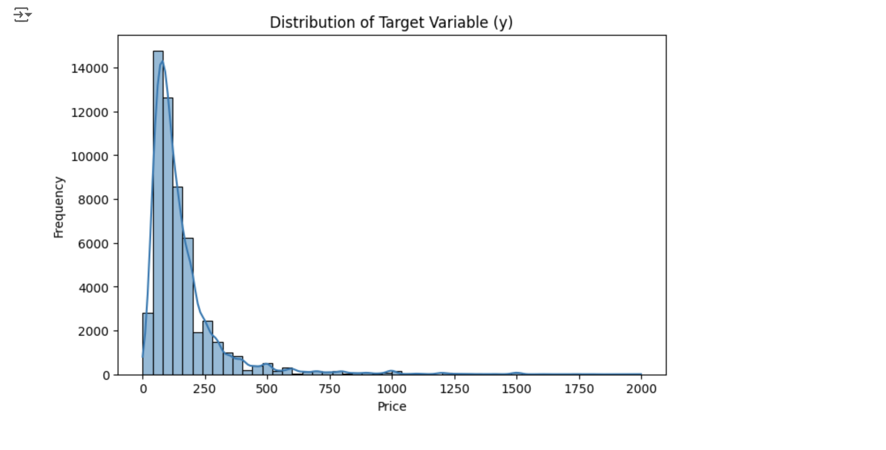

# 民泊サービス宿泊価格予測モデルの構築（練習問題）

本プロジェクトでは、民泊サービスの物件データを使用し、宿泊価格を予測する高精度なモデルを構築しました。このプロジェクトは過去のコンペを題材に取り組んだもので、データの前処理、特徴量エンジニアリング、複数の機械学習モデルの比較をしています。最終的に、宿泊価格予測の評価指標として RMSE 147.97 を達成し、全体の上位 16% にランクインしました。

---

## 📊 コンペの概要
- **課題種別**：回帰
- **データ種別**：多変量データ
- **評価指標**：RMSE (Root Mean Squared Error)

---

## 📖 背景

近年、Airbnbをはじめとする短期賃貸プラットフォームの利用がアメリカで急速に拡大しています。これにより、宿泊施設の選択肢が多様化し、観光客やビジネス利用者に新たな利便性を提供しています。一方で、物件オーナーにとって適切な価格設定を行うことは依然として難しい課題です。価格設定が不適切だと、収益の低下や競争力の喪失につながる可能性があります。

本プロジェクトでは、アメリカの都市（ニューヨーク、ロサンゼルス、サンフランシスコなど）を対象とした宿泊価格の予測モデルを構築します。このデータセットには、宿泊可能人数、アメニティ、レビュー評価、立地情報など、多様な特徴量が含まれています。これらの要因を分析し、価格に影響を与える主要な要因を特定することを目指します。

さらに、都市ごとの宿泊需要や観光のピーク時期、レビューの傾向なども考慮し、より実用的なモデルを構築します。この取り組みを通じて、物件オーナーが競争力のある価格設定を行い、収益を最大化できるよう支援することが目的です。

---

## 📊 使用データの説明
本プロジェクトでは、55,583件 の物件情報を含むデータセットを使用しています。このデータセットには、宿泊価格（目的変数）に影響を与える可能性のある 29個の特徴量 が含まれています。

### データセットの概要
  - データ件数: 55,583件
  - 特徴量数: 29（目的変数 y を含む）

### 主な特徴量:
  - 数値特徴量
    - accommodates: 宿泊可能人数
    - bathrooms, bedrooms, beds: バスルーム、ベッドルーム、ベッドの数
    - latitude, longitude: 物件の緯度・経度
    - number_of_reviews: レビューの総数
    - review_scores_rating: レビューの平均スコア

  - カテゴリ特徴量
    - property_type: 物件の種類（例: アパート、一軒家など）
    - room_type: 部屋の種類（例: Entire home/apt, Private room）
    - cancellation_policy: キャンセルポリシー（例: flexible, strict）

  - テキスト/複雑特徴量
    - amenities: 提供されるアメニティのリスト
    - description: 物件の説明
    - name: 物件名

  - その他の情報
    - cleaning_fee: 清掃費用の有無（Yes/No）
    - host_since: ホストが登録した日付
    - first_review, last_review: 最初と最後のレビュー日

  - 目的変数
    - y: 宿泊価格（USドル）

  - 欠損値の状況
    - bathrooms, bedrooms, beds などの数値特徴量には一部欠損値があります。
    - first_review や last_review などのレビュー関連情報も欠損値を含んでいます。

### データの特徴

一部の特徴量（例: zipcode, review_scores_rating）には欠損値が存在しますが、モデル構築の際に補完や削除の対応を行います。
アメニティや説明文など、テキストデータを含む特徴量が多く、特徴量エンジニアリングの工夫が必要です。

---

## 🧐 仮説と要因分析

宿泊価格に影響を与える可能性のある要因を以下のように仮定します。

### **立地条件 (`city`, `zipcode`, `latitude`, `longitude`)**
- **都市の影響**: ニューヨーク（NYC）、ロサンゼルス（LA）、サンフランシスコ（SF）などの大都市では需要が高く、宿泊価格が上昇すると予想。
- **郵便番号の影響**: 郵便番号（`zipcode`）の地域特性が価格に関連。
- **緯度・経度**: 物件の地理的な場所が価格に影響。

### **宿泊人数 (`accommodates`)**
- 宿泊可能人数が多い物件ほど、広いスペースが必要なため価格が高くなる傾向がある。

### **アメニティ (`amenities`)**
- 提供されるアメニティの種類と充実度が価格に影響。
  - 特に「キッチン」「Wi-Fi」「冷暖房」などの基本設備が価格に大きな影響を与えると予想。

### **プロパティタイプ (`property_type`)**
- アパート、一軒家、ゲストハウスなどの物件タイプが価格を決定付ける重要な要因。

### **キャンセルポリシー (`cancellation_policy`)**
- 柔軟なキャンセルポリシーを提供する物件は需要が高く、価格が上昇すると予想。

### **レビュー関連 (`review_scores_rating`, `number_of_reviews`)**
- **レビュー件数**: 宿泊者からのレビューが多い物件は信頼性が高まり、価格にも影響。
- **レビュー評価スコア**: 高評価の物件ほど人気があり、価格が上昇する傾向。

### **即時予約可否 (`instant_bookable`)**
- 即時予約が可能な物件は利便性が高く、旅行者に好まれるため価格が高くなると予想。

---

## 🔧 データ前処理の工夫

データの質を向上させ、予測精度を高めるために、以下の前処理を実施しました。

### **主な工夫**
1. **アメニティのカウント化**
   - `amenities` 列から設備リストを抽出し、上位の設備が含まれる場合にカウントして新しい特徴量を作成しました。

2. **ホストの運営年数の計算**
   - `host_since` 列を基に、ホストが登録してからの運営年数を計算し、新しい特徴量として追加しました。

3. **欠損値の補完**
   - 緯度と経度を基に、欠損している `zipcode` を補完。
   - 同様に、`neighbourhood` の欠損値も緯度と経度を基に補完。

4. **カテゴリ変数のエンコーディング**
   - **`cancellation_policy`**: 順序性を考慮してエンコーディング。
   - **`review_scores_rating`**: バケット化（スコア範囲ごとにグループ化）。

5. **ターゲットエンコーディング**
   - **`zipcode`**: 最初の3桁でグループ化し、グループごとの平均価格を計算して新しい特徴量を作成。
   - **`city` と `neighbourhood`**: グループ化して平均価格を計算し、新しい特徴量を追加。

6. **部屋の特徴量エンジニアリング**
   - **`bedrooms` と `accommodates`** の組み合わせごとに平均価格を計算し、新しい特徴量を作成。

7. **レビュー期間の計算**
   - **`first_review` と `last_review`** の日付差を計算し、レビューの活発度を表す特徴量を追加。

8. **時期や曜日の影響の考慮**
   - 宿泊価格が高くなる時期や曜日を計算し、新しい特徴量を作成。

9. **祝日データの活用**
   - `holidays` モジュールを使用して米国の祝日情報を追加。祝日が価格に与える影響を特徴量として反映。

10. **不要な列の削除**
   - モデル構築に不要と判断した列（`id`, `name`, `thumbnail_url` など）を削除。

---

## 📈 探索的データ分析 (EDA)

### **目的変数 (`y`) の分布**
- 宿泊価格（`y`）は右に長い裾を持つ分布を示しており、一部の高価格帯の物件が存在します。
- 正規分布に近づけるため、**対数変換**を試行しました。
- この変換により、モデルの収束性と予測精度の向上が期待されます。

---

### **数値変数と `y` の相関**
- 宿泊価格と数値変数の間の相関を分析しました。
  - **中程度の正の相関**を持つ特徴量:
    - `accommodates` (宿泊可能人数)
    - `bathrooms` (バスルーム数)
    - `bedrooms` (ベッドルーム数)
    - `beds` (ベッド数)
  - 相関係数はおおよそ **0.45～0.5**。
- その他の特徴量では**非線形の関係**が見られる場合があります。

相関マトリックスの分析から、宿泊可能人数やベッド数などの変数が価格に影響を与える可能性が示唆されます。

---

### **数値変数と目的変数の散布図**
1. **`number_of_reviews` と `y` の散布図**
   - 多くのレビュー数を持つ物件ほど価格は低い傾向があります。
   - ただし、一部の高価格帯物件が例外的に存在しています。

   

2. **`review_scores_rating` と `y` の散布図**
   - 高評価（`review_scores_rating` が高い）物件は価格が上昇する傾向を示しています。
   - レビューの質が価格に大きく影響していることが確認できます。

   

---

## 🛠️ 使用したライブラリ、モデル環境

### **言語**
- **Python**

### **使用した主要ライブラリ**
- **データ処理**:
  - NumPy
  - Pandas
- **機械学習**:
  - Scikit-learn
  - XGBoost
  - LightGBM（バージョン: v3.3.2）
  - CatBoost（バージョン: v1.1.1）
- **データ可視化**:
  - Matplotlib
  - Seaborn

### **開発環境**
- Jupyter Notebook
- Google Colab Pro
- GitHub

### **使用したモデル**
- **LightGBM**: 高速で効果的な勾配ブースティングモデル。
- **CatBoost**: カテゴリデータに強い勾配ブースティングモデル。
- **アンサンブルモデル**:
  - LightGBM と CatBoost の出力を加重平均で統合し、予測精度を向上。

---

## 🎯 モデルの構築と成果

本プロジェクトでは、以下の3つのアプローチでモデルを構築しました：

1. **LightGBM 単体**
2. **CatBoost 単体**
3. **加重アンサンブル** (LightGBM : CatBoost = 4 : 6)

---

### **LightGBM モデルが重視する特徴量**
- LightGBM による特徴量重要度の可視化から、`bedrooms_accommodates_avg_price` や `bathrooms` が特に重要な特徴量であることが確認されました。

---

### **CatBoost モデルが重視する特徴量**
- CatBoost の特徴量重要度では、LightGBM と同様に `bedrooms_accommodates_avg_price` や `bathrooms` が高い重要度を持つ一方で、`review_scores_rating_bucket` も高く評価されています。

---

### **モデルパフォーマンス**
以下は各モデルの RMSE スコアと結果の要約です：

- **LightGBM**:
  - **RMSE**: 150台
  - 特徴量の多様性を活かしたが、CatBoostには劣る結果。
  
- **CatBoost**:
  - **RMSE**: **147.97**
  - 最良スコアを達成（全体の上位16%）。
  - カテゴリ変数の扱いに強みを発揮。
  
- **アンサンブルモデル**:
  - 加重平均（LightGBM : CatBoost = 4 : 6）によるアンサンブルを試行。
  - パフォーマンスは CatBoost 単体とほぼ同等で、スコアの改善は見られませんでした。

---

### **工夫した点**
- **Optuna** を用いたハイパーパラメータ最適化
  - LightGBM、CatBoostの両方に対して最適なパラメータを探索。
- **KFold クロスバリデーション**
  - 各モデルの汎化性能を評価するために実施。
- **TimeSeriesSplit** の試行
  - 時系列データとしての性質を考慮しましたが、効果は限定的でした。

---

### **ポイント**
- CatBoost はカテゴリ変数を自動で効率的に扱うため、カテゴリデータが多いこのデータセットで非常に有効でした。
- LightGBM は速度と精度のバランスが良いものの、特徴量のエンコーディングが最適でない場合、性能が若干劣る可能性があります。

---

## ✅ 結論と今後の課題

### **成果**
- **最良モデル**: CatBoost  
  - カテゴリデータの扱いに強みを持つため、最終スコアが他のモデルを上回る結果を達成。
- **最終スコア**: RMSE **147.97**  
  - 全体の上位16%にランクイン。

---

### **改善点**
1. **特徴量エンジニアリングのさらなる強化**
   - 追加のデータソース（例: 近隣施設情報や交通データ）を活用した新しい特徴量の作成。
   - 時間や季節性に関連する特徴量の精緻化。

2. **外れ値の検出と処理**
   - 価格が異常に高い/低い物件に対する外れ値検出を強化。
   - 外れ値の適切な処理によりモデルの精度向上を目指す。

3. **モデルの解釈性向上**
   - **SHAP値**（SHapley Additive exPlanations）の導入により、モデルが予測に使用した要因を可視化。
   - これにより、モデルの透明性とビジネスでの活用可能性を高める。

---

### **今後のステップ**
- **さらなるハイパーパラメータ最適化**:
  - Optunaや他のツールを用いて、モデルの性能をさらに引き出す。
- **新しいアンサンブル手法の試行**:
  - スタッキングやブレンディングなど、より高度なアンサンブル手法を探索。
- **運用シナリオの検討**:
  - 実際の価格予測システムに適用する際の課題（例: リアルタイム推論やデータ更新）を検討。

---

### **補足**
- 本プロジェクトでは、機械学習モデルを用いて宿泊価格の予測を行いある程度の成果を得ることができました。
- 今後の改善により、より実用的かつ高精度なモデルの構築が期待されます。

---

## 💡 考察（インサイト）

### **1. 重要な特徴量とその意味**
- **`bedrooms_accommodates_avg_price`**:
  - **価格に最も大きな影響を与える特徴量**。
  - 宿泊可能人数とベッドルームの組み合わせは、物件の基本的な需要を反映。
- **`bathrooms`**:
  - バスルームの数が増えるほど価格が上昇する傾向。
  - 利便性が価格に直結している可能性。
- **`city_neighbourhood_avg_price`**:
  - 地域ごとの平均価格が特徴量として重要。
  - 周辺エリアの相場が価格設定に影響。
- **`review_scores_rating`**:
  - 高評価のレビューが価格にプラスの影響。
  - 実績や顧客満足度の高さが重要と考えられる。

---

### **2. 実務への応用例**
1. **宿泊業者向けの価格最適化ツール**
   - モデルの予測結果を基に、価格設定のシミュレーションツールを提供。
   - 例: シーズンやレビュー評価に応じた価格提案機能。

2. **地域の価格戦略分析**
   - **競合分析**: 周辺地域の平均価格データを活用し、競争力のある価格設定を支援。
   - **新規参入サポート**: 初めてリスティングを登録するホストに参考価格を提供。

3. **レビュー評価向上施策**
   - 高評価レビューが価格に与える影響が大きいため、レビューの取得方法や顧客体験の改善に注力。
   - 例: 滞在後の自動フォローアップメール送信、レビュー取得インセンティブの提供。

4. **物件タイプ別の戦略立案**
   - アパート、一軒家、ゲストハウスなど、物件タイプ別の価格帯を提示し、ターゲット層に応じた戦略を立案。

---

### **3. 使用したツールや技術**
- **データ処理**: NumPy, Pandas
- **モデル構築**: Scikit-learn, LightGBM, CatBoost
- **ハイパーパラメータ最適化**: Optuna
- **可視化**: Matplotlib, Seaborn
- **デプロイ案**:
  - Webアプリケーション（Flask または FastAPI を使用）
  - Google Cloud Platform（GCP）または AWS でのモデルホスティング

---

### **補足**
本プロジェクトの考察を通じて、宿泊価格に影響を与える主要な要因を明らかにし、それらを活用した実務的な応用方法を提案しました。さらなるデータ収集と特徴量エンジニアリングの強化により、より精度の高い意思決定支援が可能となると考えます。

---

## ガバナンス、セキュリティー、メタデータの管理に関する補足
### データの管理方法:
データのプライバシー保護や適切なアクセス管理。

### メタデータ管理:
データセットのバージョン管理や説明（データカタログ化）。

### セキュリティ考慮:
仮に本番運用を想定した場合、どのようにデータとモデルを保護するか。

---

## 📧 連絡先
このプロジェクトに関するお問い合わせやコラボレーションのご提案は、以下の連絡先までお願いします。
- GitHub: [capri7](https://github.com/capri7)
- LinkedIn: [プロフィールリンク](https://www.linkedin.com/in/kazue-hayakawa-a650672b1/)

---

